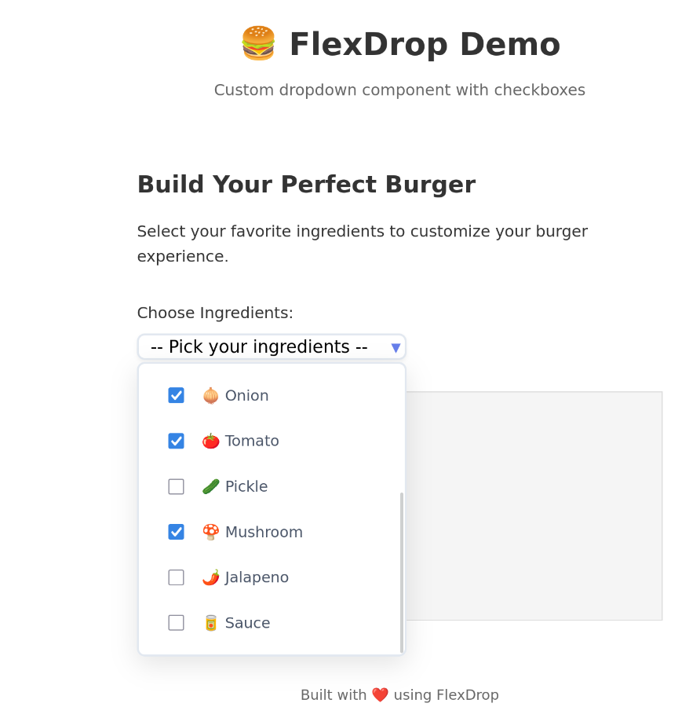

# 🍔 FlexDrop - Custom Dropdown Component

In development - A lightweight, customizable dropdown component with checkbox selection support. Perfect for multi-select scenarios with a clean, modern interface.



## ✨ Features

- ✅ **Checkbox Selection** - Multi-select support with visual checkboxes
- ✅ **Smart Dropdown Behavior** - Stays open for easier multi-selection
- ✅ **Click Outside to Close** - Intuitive interaction pattern
- ✅ **Perfect Alignment** - Clean, aligned items for professional look
- ✅ **Smooth Overlay** - Dropdown overlays content instead of pushing it down
- ✅ **Cross-Browser Compatible** - Works consistently across all browsers
- ✅ **Responsive Design** - Adapts to different screen sizes
- ✅ **Customizable Styling** - Easy to customize with CSS

## 🚀 Quick Start

### 1. Include the Files

```html
<link rel="stylesheet" href="flexdrop.css">
<script src="dropdown.js"></script>
```

### 2. HTML Structure

```html
<div class="flex-dropdown>   <ul class="flex-dropdown-select" name=ingredients" id="ingredients">
        <li class="flex-dropdown-option premier">-- Pick your ingredients --</li>
    </ul>
    <ul class="flex-dropdown-options" name=ingredients" id="ingredients">
        <li class="flex-dropdown-option" value="beef">
            <input class="flex-dropdown-checkbox" type="checkboxname="beef" id=beef" value="beef">
            <span class="option-text">🥩 Beef</span>
        </li>
        <li class="flex-dropdown-option" value="chicken">
            <input class="flex-dropdown-checkbox" type="checkbox" name="chicken" id="chicken" value="chicken">
            <span class="option-text>🍗 Chicken</span>
        </li>
        <!-- Add more options as needed -->
    </ul>
</div>
```

###3lize the Component

```javascript
document.querySelectorAll(.flex-dropdown').forEach(el => new FlexDropdown(el));
```

## 🎨 Customization

### Basic Styling

The component comes with a clean, modern design that you can easily customize:

```css
/* Customize the select area */
.flex-dropdown-select [object Object]
    border-color: #your-color;
    background-color: #your-bg-color;
}

/* Customize the dropdown options */
.flex-dropdown-options {
    background-color: #your-bg-color;
    border-color: #your-border-color;
}

/* Customize hover effects */
.flex-dropdown-option:hover {
    background-color: #your-hover-color;
}
```

### Advanced Customization

You can customize every aspect of the dropdown:

- **Colors**: Change borders, backgrounds, text colors
- **Spacing**: Adjust padding, margins, and gaps
- **Typography**: Modify font sizes, weights, and families
- **Animations**: Add custom transitions and hover effects
- **Sizing**: Control width, height, and positioning

## 📱 Browser Support

- ✅ Chrome (latest)
- ✅ Firefox (latest)


## 🔧 API Reference

### FlexDropdown Class

The main class that handles all dropdown functionality.

#### Constructor
```javascript
new FlexDropdown(element)
```

#### Properties
- `element` - The dropdown container element
- `select` - The select trigger element
- `options` - The options list element

#### Methods
- `init()` - Initializes the dropdown
- `calculateWidths()` - Calculates and sets component widths

## 🎯 Use Cases

### Multi-Select Forms
Perfect for ingredient selection, tag selection, or any scenario requiring multiple choices.

### Filter Interfaces
Great for creating filter dropdowns where users can select multiple criteria.

### Settings Panels
Ideal for configuration panels where users need to enable/disable multiple options.

### E-commerce
Perfect for product filtering, category selection, and attribute selection.

## 📦 File Structure

```
flexdrop/
├── flexdrop.css      # Component styles (independent)
├── dropdown.js       # Component functionality
├── style.css         # Demo styles (optional)
├── demo.html         # Demo page
└── README.md         # This file
```

## 🛠️ Development

### Building from Source

1. Clone the repository
2. Open `demo.html` in your browser
3. Customize styles in `flexdrop.css`
4. Modify functionality in `dropdown.js`

### Contributing

1. Fork the repository
2. Create a feature branch
3. Make your changes
4. Test across different browsers
5. Submit a pull request

## 📄 License

MIT License - feel free to use in your projects!

## 🤝 Support
**You can star this project if you like it :).**
- If you have questions or need help:
1. Check the demo page for examples
2. the code comments
3. Open an issue on GitHub

---

**Built with ❤️ for better user experiences**
